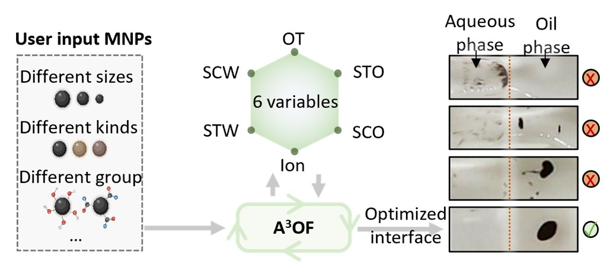

# A3OF: An Autonomous, Apprehensible, and Accelerated Optimization Framework for Nanoparticle Interfacial Dynamics

This repository contains the source code, demonstration data, and documentation for A3OF framework.

---

## Framework overview



**Figure 1.** Overview of the proposed autonomous, apprehensible, and accelerated optimization framework. 
---

## Repository structure

```text
├── requirements.txt                   # Top-level Python dependencies
│
├── Multi-agent workflow/              # LLM-driven scientific discovery pipeline
│   ├── multiagent_pipeline.py         # LangGraph orchestrator for the 6-agent workflow
│   ├── Extraction agent.py            # SHAP analysis → non-linear experimental associations
│   ├── query agent.py                 # Qwen LoRA models → query1 / query2 / query3 generation
│   ├── Query intermediate variables.py# LLM infers the intermediate variable from query1
│   ├── mining agent.py                # Consensus+browser-use → paper search & PDF download
│   ├── searching agent.py             # MinerU + GraphRAG + Chroma hybrid evidence retrieval
│   ├── writing agent.py               # Generalized-mechanism extraction & explanation synthesis
│   ├── judging agent.py               # Two-stage vetting (evidence-grounding + association-consistency)
│
├── Automation/                        # Physical closed-loop autonomous lab
│   ├── Main.py                        # Master controller: BO → OT-2 → CV → reward loop
│   ├── Optimizer.py                   # BoFire Bayesian optimization over 6-D recipe space
│   ├── OT-2_control.py                # OT-2 pipetting robot serial-command executor
│   ├── Pre-detection.py               # Oil-surfactant compatibility pre-screening
│   ├── Characterization.py            # Quantitative reward feedback
│   ├── BO-test.csv                    # Historical experiment log
│   └── Arduino/                       # ESP32 firmware for linear-stage, gripper, MNP transport
│
└── BO-accleration/                    # Prior-informed BO benchmarks & acceleration
    ├── BO-accleration for different MNPs/
    │   ├── BO-Antibody-Exosome-optimization.py   # PiBO for antibody-exosome MNP systems (6 vars)
    │   ├── BO-DNA-optimization.py                # PiBO for DNA-functionalized MNP systems (3 vars)
    │   ├── BO-test.csv                           # Historical experiment records
    │   ├── shap_results_water_oil.json           # SHAP payload for prior construction
    │   └── Prior_knowledge_from_used_MNP.txt      # Domain-knowledge impact summary
    └── Benchmark/
        ├── LLM-warm start/
        │   ├── Warm-start chemical.py            # LLM warm-start vs. random/LHS/Sobol on chemical yield
        │   ├── Warm-start testfunction.py        # LLM warm-start vs. random/LHS/Sobol on Hartmann6
        │   └── Warm-start LLM.py                 # Extracts initial-sample mean yields from BO traces
        └── G(x) method/
            ├── Chemical-LLM-BO-G.py              # PiBO with GMM prior + LLM warm-start (chemical)
            └── Test function-LLM-BO-G.py          # PiBO with GMM prior + LLM warm-start (Hartmann6)
```

The names and locations of individual scripts may differ slightly between software releases.

---

# 1. System requirements

## Supported operating systems

The software has been developed and tested on:

- Windows 11, 64-bit
- Python 3.11
- Conda-based Python environment

Linux and macOS have not yet been formally validated.

## Software dependencies

The principal dependencies include:
Exact package versions are provided in [`requirements.txt`](requirements.txt).

## External services

Some components require access to external services and corresponding API credentials:

- OpenAI API key (`OPENAI_API_KEY`) for language-model inference and text embedding generation used by the Extraction and Mining agents.
- Agicto API key (`AGICTO_API_KEY`) and base URL (`AGICTO_BASE_URL`) for query, searching, writing, and judging agents.
- Browser-use API key (`BROWSER_USE_API_KEY`) for browser-based web automation in the Mining agent.
- MinerU token (`MINERU_TOKEN`) for PDF parsing and scientific-document conversion in the Searching agent.
- Consensus credentials (`CONSENSUS_EMAIL`, `CONSENSUS_PASSWORD`) for automated literature search and retrieval in the Mining agent.

Internet access is required when these external services are enabled.

## Tested configuration

The framework has been tested with the following configuration:

- Operating system: Windows 11, 64-bit
- Python: 3.11
- Environment manager: Conda
- CPU: ntel(R) Core(TM) Ultra 5 225H (1.70 GHz)
- Memory: 16 GB RAM or greater recommended
- GPU: RTX 5050
- Storage: At least 10 GB of free disk space recommended

# 2. Installation guide

## Create a Conda environment

```bash
conda create -n your_env python=3.11
```

## Install dependencies

Details see requirements.txt

## Configure API credentials
Write your own api_keys to the .env file.

# 3. Run the code
For reproducibility of the multi-agent framework, we provide the experimental datasets and required resources used in this study, including:

- `augmented_data_with_pic.csv`: Experimental data with image references.
- `caption.csv`: Image-derived morphological descriptions.
- `Model/`: Fine-tuned Qwen LoRA adapters.
- 
Due to potential copyright restrictions, the original publications are not redistributed. The `Papers/` directory contains the literature resources used during RAG database construction, and users are responsible for ensuring appropriate access and usage rights.

The complete multi-agent workflow can be initiated by running:

```bash
python multiagent_pipeline.py


